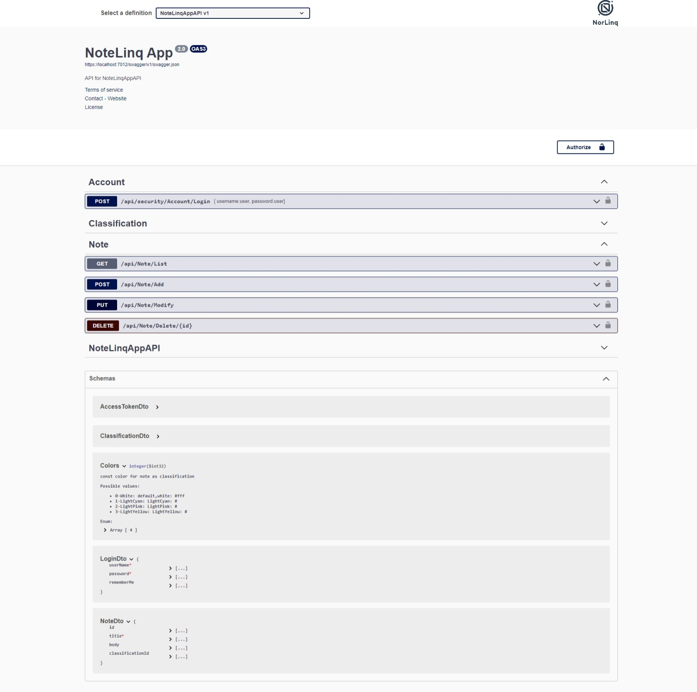
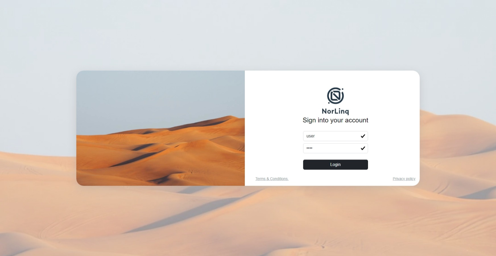
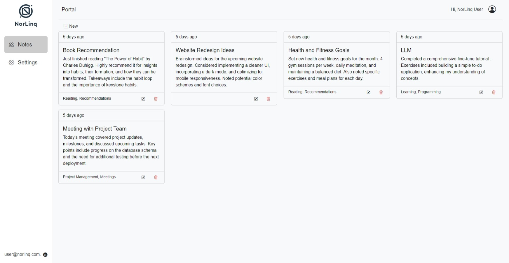

# NoteLinqApp

`Note Taking App`

To run project follow the instructions:


## Backend

> Asp .Net Core 8.0 WebApi

1. Install Visual Studio 2022 17.8 or  later / .net 8.0 with Asp core sdk .

2. Build the projects, ensure that all nuggets downloaded and check valid localhost:port.

3. Set `Application/WebAPIs/NoteLinqAppAPI` as default project.

4. Run&start, check customized swagger 

   

5. Copy your Baseurl

6. Test login by `check seed data - Infrastructure`

   ```json
   request:{
     "userName": "user",
     "password": "user",
     "rememberMe": true
   }
   ```

   ```json
   res:{
     "name": "NorLinq User",
     "userName": "user",
     "email": "user@norlinq.com.",
     "accessToken": "eyJhbGciOiJo........"
   }
   ```

7. enjoy 😎.


## FrontEnd

> Vue 3

1. Exec Commands

   1. Go to project path `Application/Presentation/NoteLinqApp` , use *cmder* or default cmd
   2. **insure that up to date node.js installed  9. / vue cli not required /  vite  **

   ```cmd
   npm i
   ```

2. Build And Run

   ```cmd
   npm run dev
   ```

   ​

3.  replace Baseulr `NoteLinqApp\src\core\appsettings.ts` to your port

   ```ts
   export const baseUrl = "https://localhost:7012/api/"; //<--

   export const....
   ```

4. check the pages and login

   

5. there no alert or toaster , simple ui with handle some validation `facing any error will run or build check dev tool and cmd`

   


______


> Happy coding!


[MhozaifaA/NoteLinqApp (github.com)](https://github.com/MhozaifaA/NoteLinqApp)

Huzaifa Aseel